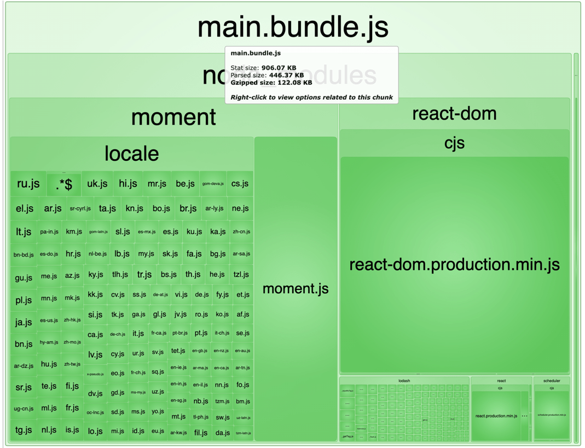
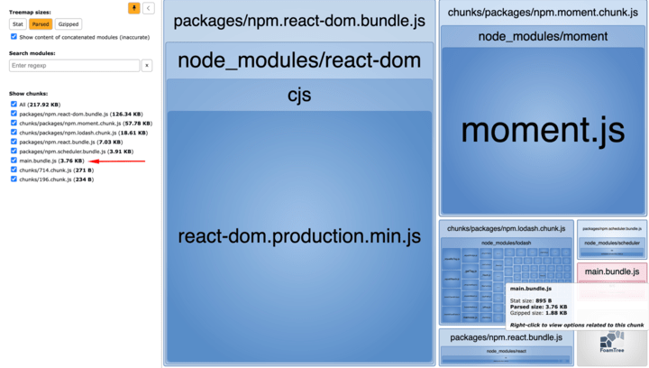
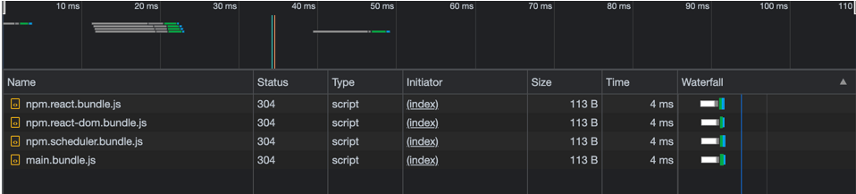
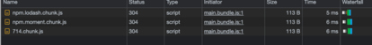
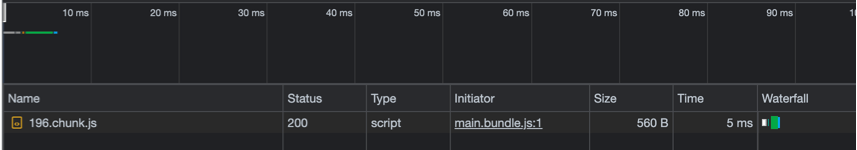

# webpack split chunks with react

Trying to manage a react bundle in order to split bundle into small splitted js chunks

## Bundle Analisys

| 🚫 Bare webpack bundle                 | ✅ Splitted webpack bundle                     |
| -------------------------------------- | ---------------------------------------------- |
|  |  |
|                                        |

## Runtime behaviour

At the first load, webpack will load each splitted package bundles first.

Webpack will lazy-load Component B when needed with their dependency chunks (moment and lodash).

When Component A requested, webpack will load it, but will not load lodash again, because it was loaded before.

